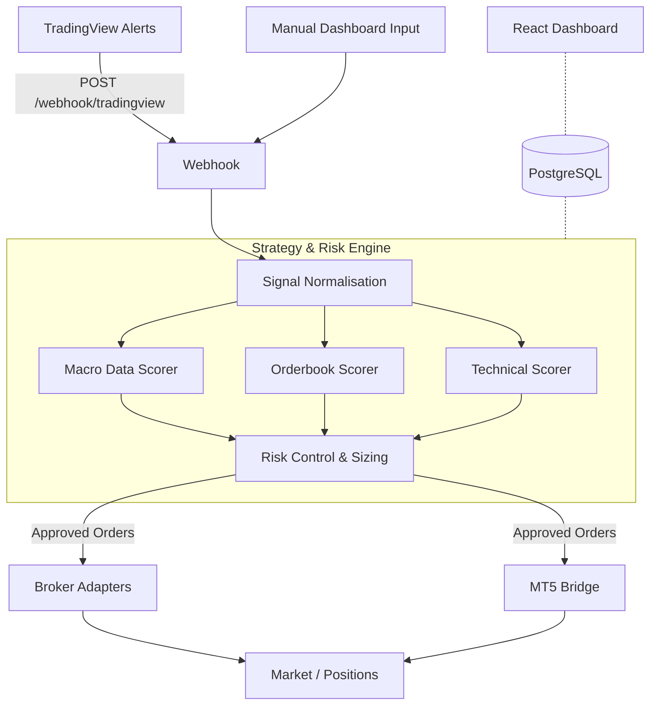

# Algo Signal Engine (External Trading Engine)

> [!NOTE]
> **Action Required**: Add a real screenshot of your dashboard here to instantly show off the project's quality. 
> Example: ``

### High-Level Summary
- **External multi-signal trading engine**
- **TradingView + internal strategies**
- **Risk-managed execution**
- **Broker adapters + optional MT5 bridge**

A production-grade, full-stack automated trading engine designed to ingest TradingView alerts, normalise signals, apply strategy/risk rules, and route execution to broker adapters. It features a powerful frontend dashboard for real-time monitoring of multi-signal trade decisions (macro, orderbook, earnings, technical).

## Why this exists

- **Modular & External**: Acts as an external orchestration layer rather than a single broker-bound bot.
- **Multi-Strategy**: Combines technical indicators, macroeconomic data, and orderbook imbalances.
- **Risk-Managed**: Centralizes risk controls across all incoming signals before they reach the broker.
- **TradingView Compatible**: First-class support for TradingView webhook alerts.
- **MT5 Optional**: Can act as the "brain" while an MT5 bridge handles execution.

## Tech Stack

- **Backend**: Node.js, TypeScript, Express
- **Frontend**: React + Vite + Wouter + TanStack Query + Recharts
- **Database**: PostgreSQL + Drizzle ORM
- **Data Sources**: Binance, Yahoo Finance, FRED, Finnhub
- **Deployment**: Docker, Caddy/Nginx
- **Orchestration**: pnpm workspaces

### Backend (API Server)
- Receives TradingView alerts
- Normalises signals
- Scores macro, orderbook, and technical data
- Applies risk rules
- Routes execution to broker adapters
- Stores everything in PostgreSQL

### Frontend (Dashboard)
- Reads from PostgreSQL
- Displays live signals
- Shows macro climate and orderbook imbalance
- Allows manual signal injection
- Provides system telemetry

## Architecture



## Folder Structure Explained

```text
.
├── artifacts/api-server/     # Express API backend, webhooks, and routing
├── artifacts/trading-engine/ # React dashboard frontend
├── artifacts/signal-mobile/  # React Native (Expo) mobile app
├── lib/                      # Core trading logic, DB schema, fetchers, adapters
├── config/                   # Environment and runtime configuration
└── scripts/                  # Setup, testing, and utility scripts
```

## Features

- **Dashboard**: Live summary cards (total/BUY/SELL counts, avg confidence), recent signal feed, macro climate panel, orderbook imbalance bars.
- **Signals**: Full history table with symbol/type filters, manual signal generation.
- **Market Data**: Orderbook imbalance per symbol, macro (Fed/inflation/VIX/CPI/GDP), earnings calendar.
- **Strategy Engine**: Scores signals from four components with configurable weights stored in the DB.
  - **Technical Fetcher**: Live candles from Binance / Yahoo Finance for RSI, MACD, EMA, ATR.

## Integration & Extensibility

### TradingView Webhook Example
Configure your TradingView alerts to send a JSON payload to `POST /webhook/tradingview`:
```json
{
  "symbol": "XAUUSD",
  "action": "buy",
  "confidence": 0.82,
  "strategy": "tv_breakout",
  "timestamp": "{{timenow}}"
}
```

### Signal Schema
All incoming signals are normalised into a standard schema for the engine:
```typescript
interface NormalisedSignal {
  symbol: string;
  action: "BUY" | "SELL" | "NEUTRAL";
  confidence: number;
  source: "tradingview" | "internal" | "manual";
  metadata?: Record<string, any>;
}
```

### Broker Adapters
The engine routes approved signals through standardized broker adapters. Implement this interface to add your own broker:
```typescript
interface BrokerAdapter {
  placeOrder(order: OrderRequest): Promise<OrderResult>;
  closeOrder(id: string): Promise<void>;
  getPositions(): Promise<Position[]>;
  getBalance(): Promise<BalanceInfo>;
}
```

### Risk Engine
Before any signal reaches a broker, it must pass through the Risk Engine, which enforces:
- **Max Daily/Weekly Loss** constraints
- **Max Exposure** per asset and asset class
- **Volatility Filters** (e.g., blocking trades during VIX spikes)
- **News Windows** (suspending trading around high-impact macroeconomic events)
- **Circuit Breakers** for system anomalies

## Quick Start (Local Development)

This project is structured as a pnpm monorepo.

1. **Install dependencies:**
   ```bash
   pnpm install
   ```

2. **Environment Variables:**
   Copy `.env.example` to `.env` and fill it out:
   - `DATABASE_URL` (Required) — Postgres connection string
   - `FRED_API_KEY`, `ALPHAVANTAGE_API_KEY`, `FINNHUB_API_KEY` (Optional) — Enrich macro/earnings data
   - `WEBHOOK_SECRET` — For securing TradingView payloads

3. **Run the Database push (if needed):**
   ```bash
   pnpm --filter @workspace/db run push
   ```

### Development Workflow
You can run individual parts of the stack using pnpm filters:

```bash
pnpm --filter @workspace/api-server run dev
pnpm --filter @workspace/trading-engine run dev
pnpm --filter @workspace/signal-mobile run dev
```

## Deployment (VPS / Docker)

For production deployment on a VPS, use the provided Docker configuration.

```bash
docker compose up --build -d
```

### Production Checklist

- [ ] HTTPS enabled
- [ ] Webhook secret configured
- [ ] DB backups enabled
- [ ] Reverse proxy configured (Caddy / Nginx)
- [ ] Docker restart policy enabled
- [ ] Health checks monitored
- [ ] Broker API keys rotated
- [ ] Firewall rules applied

## Security Considerations
Since this is a real-money trading engine, ensure the following are configured in production:
- **Webhook Secret**: Validate incoming TradingView payloads using a secret token.
- **API Key Usage**: Restrict access to the dashboard and manual signal endpoints.
- **Rate Limiting**: Protect the API against spam or malicious requests.
- **Firewall Rules**: Only allow inbound traffic on ports 80/443 (for web) and restrict DB access to localhost/internal Docker networks.

## Notes & Gotchas

- **Binance API**: May return HTTP 451 from geo-blocked environments. Orderbook fetcher falls back to NEUTRAL with 0% imbalance in such cases.
- **Macro vs. Fed Signals**: `macroSignal` on a Signal row is the engine's interpretation (`BULLISH|BEARISH|NEUTRAL`). `fedSignal` on MacroData is the raw Fed stance (`DOVISH|HAWKISH|NEUTRAL`).
- **Legacy Python Code**: The `app/` and `main.py` files are legacy Python implementations and are superseded by the TypeScript/Node.js stack.
