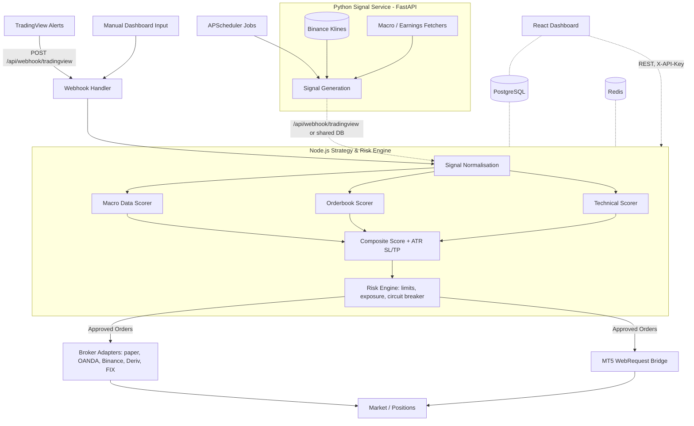

# Architecture

This document describes how the Algo Signal Engine / External Trading Engine
is put together: the two backend services, the data flow from signal
generation to broker execution, and where each concern lives in the codebase.

## Overview

The system is composed of two independent backend services plus a frontend:

1. **Express API server** (`artifacts/api-server/`) — the primary
   orchestrator. Owns the database, the strategy/risk engine, broker
   adapters, the MT5 bridge, and the scanner loop. This is what the
   dashboard and TradingView talk to.
2. **Python signal service** (`app/`, `config/`, `run.py`) — a FastAPI
   application, run with `python run.py`, that independently fetches market
   data (including live Binance klines) and macro/earnings data on a
   schedule (via APScheduler), computes technical signals, and can send
   signals onward to TradingView.
3. **React dashboard** (`artifacts/trading-engine/`) — reads signal, market,
   and config data from the Express API server and lets operators inject
   manual signals and tune engine configuration.

A React Native mobile client (`artifacts/signal-mobile/`) consumes the same
API surface as the dashboard.

## High-Level Flow



## Express API Server

Entry point: `artifacts/api-server/src/index.ts`, which starts the HTTP
server (`app.ts`) on `PORT` (default `8080`) and starts the background
`scannerLoop`.

Key modules under `artifacts/api-server/src/lib/`:

- `engine/strategy-engine.ts` — combines technical, orderbook, macro, and
  earnings scores into a single normalized `[-1, +1]` score, applies the
  configured threshold to decide `BUY` / `SELL` / `NONE`, and computes
  ATR-based stop-loss and take-profit levels when a signal fires.
- `engine/technical-fetcher.ts`, `engine/orderbook-fetcher.ts`,
  `engine/macro-fetcher.ts` — live market/technical/orderbook/macro data
  fetchers feeding the strategy engine.
- `engine/scanner-loop.ts` — background loop that periodically triggers scan
  cycles across tracked symbols.
- `risk/risk-engine.ts` — the `RealRiskEngine`, described in
  [`docs/RISK.md`](RISK.md).
- `brokers/` — `IBrokerAdapter` implementations (paper, OANDA, Binance,
  Deriv, ICMarkets FIX, MT5) selected via `broker-factory.ts`.
- `statemachine/trade-state-machine.ts` — tracks a trade through
  `INIT → VALIDATED → EXECUTED → MANAGED` (or `ERROR`) states.
- `observability/soc-logger.ts`, `observability/metrics-engine.ts` — security
  operations-style structured logging and a runtime metrics snapshot,
  exposed via `/api/observability`.
- `backtesting/backtest-engine.ts` — runs historical strategy backtests,
  exposed via `/api/backtesting/run`.

Routes live in `artifacts/api-server/src/routes/` and are aggregated in
`routes/index.ts`, mounted under `/api` in `app.ts`. See
[`docs/API.md`](API.md) for the full endpoint reference.

Data persistence uses PostgreSQL via Drizzle ORM (`lib/db/src/schema/`):
`signals`, `webhook_logs`, and `engine_config` (a single-row table holding
symbols, strategy weights, threshold, and auto-send toggle).

## Python Signal Service

Entry point: `run.py`, which runs the FastAPI app defined in `app/main.py`
via `uvicorn`. Configuration is loaded through `pydantic-settings`
(`config/config.py`), which reads from `.env` and environment variables —
covering the port, log level, API keys for macro/earnings/broker data
sources, the TradingView webhook URL, the shared `API_KEY` for
`X-API-Key` authentication, and the tracked symbol list.

Responsibilities:

- `app/data_sources/macro.py` — macroeconomic data fetching (Fed stance,
  inflation, VIX, CPI, GDP).
- `app/data_sources/orderbook.py` — orderbook imbalance data.
- `app/data_sources/earnings.py` — earnings calendar fetching.
- `app/strategies/engine.py` — Python-side scoring engine (RSI, EMA, ATR,
  weighted macro/orderbook/technical/earnings composite).
- `app/tradingview/webhook.py` — sends generated signals to the configured
  TradingView webhook URL.
- A scheduled job (APScheduler) periodically fetches market data and
  generates/sends signals; a separate daily job refreshes the earnings
  calendar.

Live pricing for technical scoring is pulled from Binance klines, replacing
placeholder/simulated price data with real OHLC candles.

The service exposes `/health` and `/metrics` endpoints for liveness and
runtime metrics, plus `X-API-Key`-protected endpoints for receiving
TradingView webhooks and triggering manual signal generation.

## Frontend Dashboard

`artifacts/trading-engine/` is a Vite + React app that talks to the Express
API server over REST (using generated hooks from `lib/api-client-react/`,
built from the OpenAPI spec). It surfaces:

- Live signal feed and summary counts.
- Macro climate and orderbook imbalance panels.
- Manual signal generation and TradingView send.
- Engine configuration (symbols, weights, threshold, auto-send).
- System telemetry (SOC logs, metrics, scanner health).

## API Contract

`lib/api-spec/openapi.yaml` is the single source of truth for the Express
API's request/response shapes. `lib/api-zod/` (Zod schemas) and
`lib/api-client-react/` (React Query hooks) are generated from it via Orval;
regenerate them with:

```bash
pnpm --filter @workspace/api-spec run codegen
```

## Why Two Backend Services?

The Express API server is the system of record — it owns the database, the
risk engine, and broker execution, and is what the dashboard depends on. The
Python service exists to reuse Python's data/science ecosystem (pandas,
numpy, yfinance) for market data fetching and technical analysis, and can run
independently on its own schedule. The two integrate through the TradingView
webhook contract and, over time, are intended to share signal storage more
directly (see the [README roadmap](../README.md#roadmap)).
